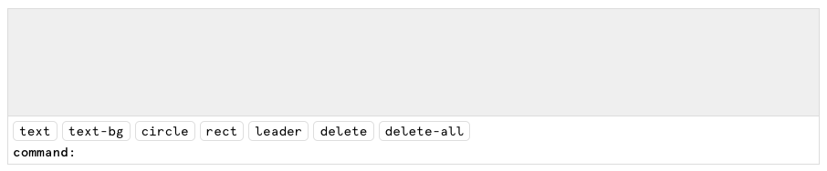
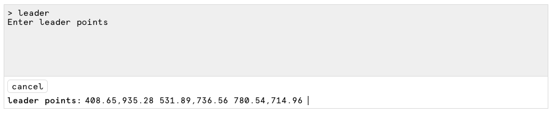
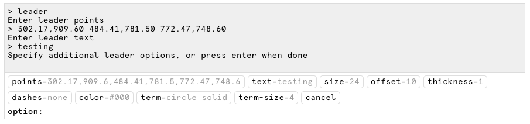
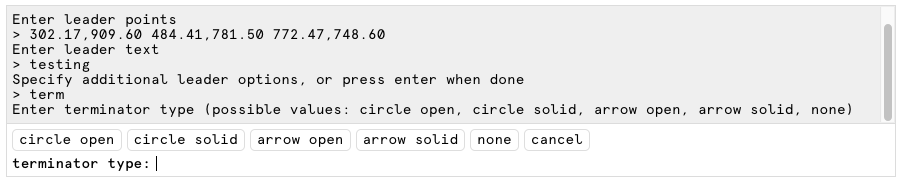

# Vue Interactive CLI

An interactive CLI component for **Vue 3**, inspired by Rhino3d's command prompt UX. To configure,
supply a list of commands to recognize, with options. Once a command is submitted, 
the component will emit out a result object with properties corresponding to the 
command options you configured. Any required command options are auto-prompted.










## Install

```
npm i --save vue-interactive-cli
```

```js
import 'vue-interactive-cli/dist/InteractiveCLI.css';
import CLI from 'vue-interactive-cli';
```

## Usage
### Props

| name | type | note | 
| --- | ---- | --- |
| `commands` | Array | *see Specifying Commands below
| `output-rows` | Number | number of rows to display in the CLI output
| `prompt-write` | String | changing this will write to the input and submit |
| `prompt-append` | String | changing this will append to the input without submitting |
| `output-print` | String | changing this will print a line to the output |

### Events

- `cmd-start` - cmd name
- `cmd-progress` - cmd name, in-progress output object (_note: starts 
  emitting once all required options have been completed_)
- `cmd-complete` - cmd name, final output object
- `cmd-cancel` - cmd name
- `opt-start` - opt name, opt config object
- `opt-complete` - opt name, opt val, in-progress output object
- `opt-cancel` - opt name

### Specifying Commands and Command Options

Provide the `commands` prop with an array as detailed below:

```js
[
  {
    command: 'my-command-name',

    // if no options required, leave as empty array
    options: [
      {
        name: 'name' // e.g. the property name inside the returned command result object
        type: 'string', // see types list below
        required: true, // optional
        prompt: 'enter name' // optional
      },
      {
        name: 'fruit',
        type: 'enum',
        required: false,
        prompt: 'favorite fruit?',
        opts: ['kiwi', 'mango', 'banana'], // specify enum options
        default: 'kiwi' // should specify if not `required`
      },
      {
        name: 'inches',
        type: 'number',
        default: 100
      },
      {
        name: 'cities',
        type: 'array',
        prompt: 'recent cities'
      },
      {
        name: 'summer',
        type: 'boolean',
        prompt: 'is it summer yet',
        default: false
      }
    ]
  }
]
```

The above configuration defines a single command. After completing the 
`my-command-name` command, the command result object would be emitted from
the `cmd-complete` and contain the following property names:

```js
{
  type: 'my-command-name',
  name: 'my name',
  fruit: 'kiwi',
  inches: 100,
  cities: ['Cambridge', 'Somerville', 'Boston'],
  summer: true
}
```

### Valid command option types
- `string`
- `number`
- `enum` (restricted input, returned as string)
- `array` (outputs as array of strings based on comma-separated input; input format: `a,b,c,d`)
- `boolean`
- `point` (outputs as an array of 2 numbers; input format: `a,b`
- `points` (outputs as an array of arrays with 2 numbers; input format: `a,b c,d e,f`)

## Todo

- custom option input verify functions